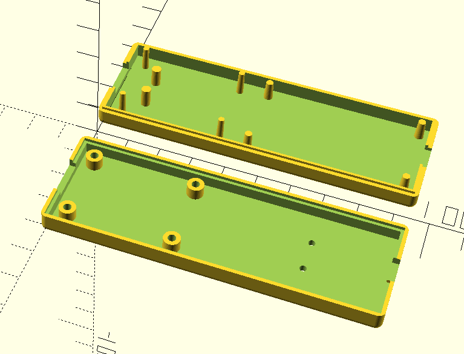

# Enclosure

3D printed enclosure.

Use the SCAD file to make any changes. You can use the following:

```
create_whole                = false; // set to true to see the whole piece
print_bottom                = true;  // set to false to create only the top part
print_top                   = true;  // set to false to create only the bottom part
```

Then use the 'Export to STL (F7)' function in OpenSCAD to export your STL files. Then slice them with your favorite slicer and 3D print them.

## License
This work is licensed under the [Creative Commons Attribution-NonCommercial-ShareAlike 4.0 International License (CC BY-NC-SA 4.0)](https://creativecommons.org/licenses/by-nc-sa/4.0/).

You are free to copy, modify, and share this project **for non-commercial purposes only**, as long as you give credit and license your new creations under the same terms.

## End product


