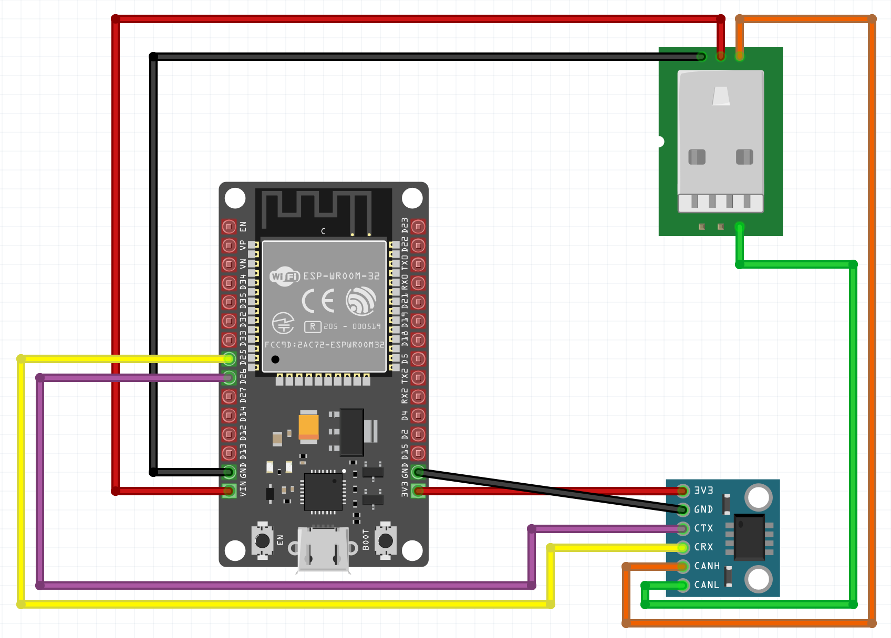
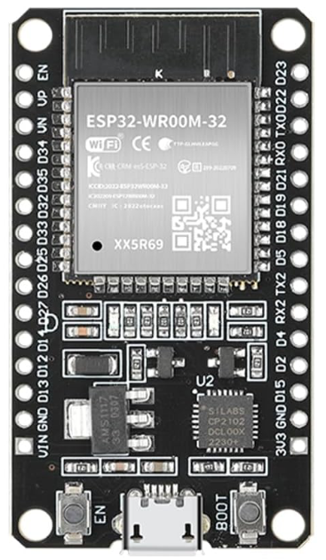
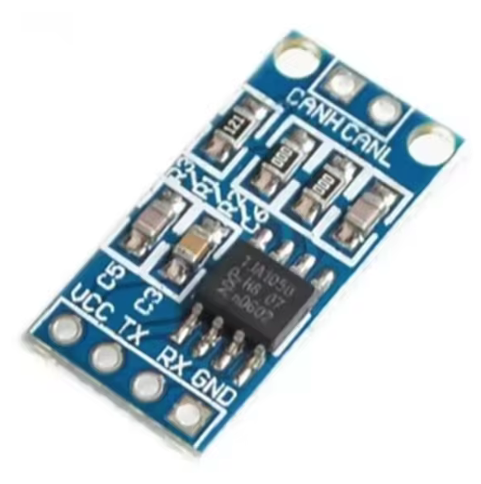
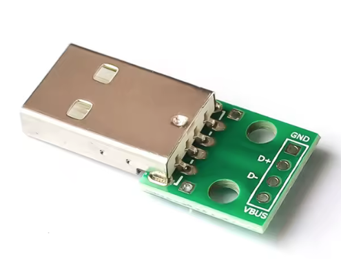
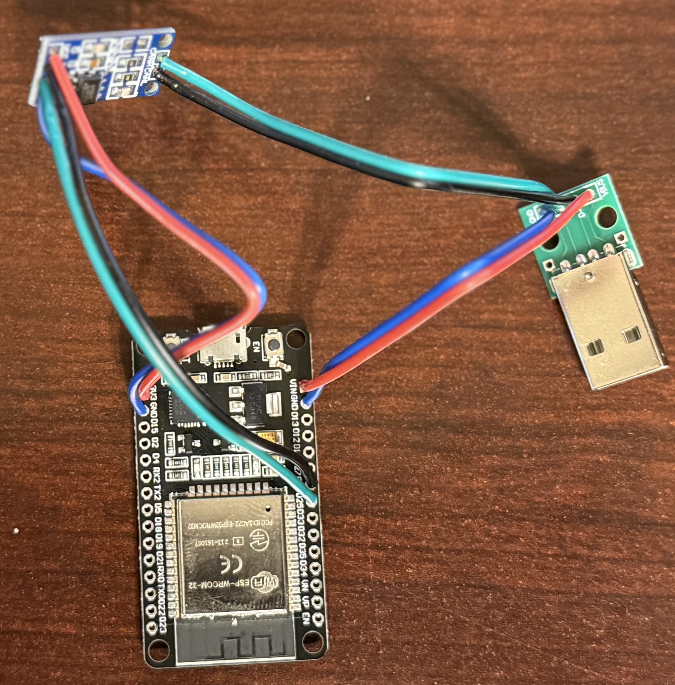
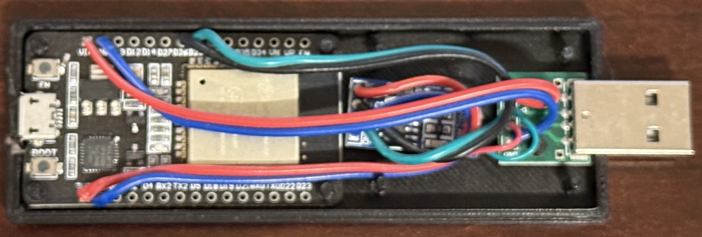

# Hardware

Schematic for the Votol BT adaptor hardware.

[Fritzing](https://fritzing.org) file attached. I could not find the exact parts footprint, nor had the patience to [desing](https://fritzing.org/learning/tutorials/creating-custom-parts) my own.

## License
This work is licensed under the [Creative Commons Attribution-NonCommercial-ShareAlike 4.0 International License (CC BY-NC-SA 4.0)](https://creativecommons.org/licenses/by-nc-sa/4.0/).

You are free to copy, modify, and share this project **for non-commercial purposes only**, as long as you give credit and license your new creations under the same terms.

## Schematic

## Part list

#### ESP32-Wroom32 (no headers)

#### TJA1050 CAN bus driver

#### USB A Male Breakboard

## Actual routing

